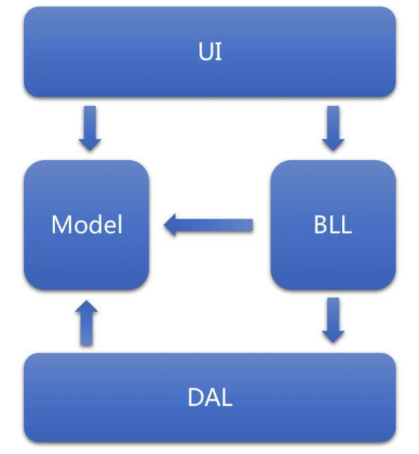
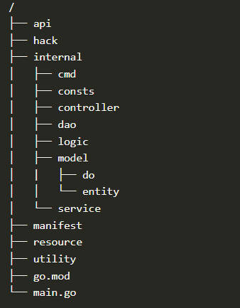
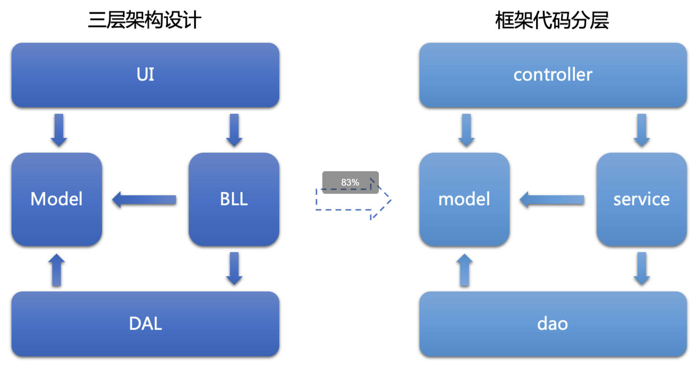
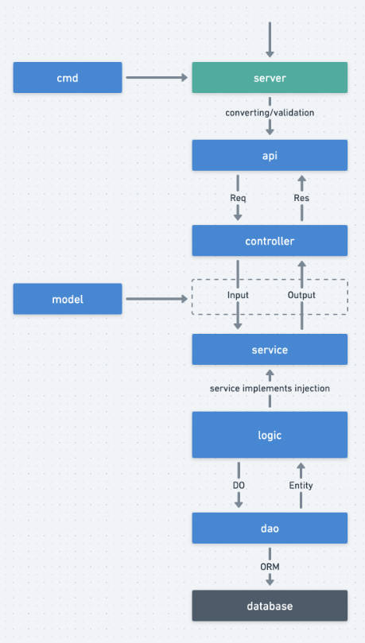

# 1.代码分层设计

意义:将代码解耦，将层级直接的数据流和依赖关系设计为单项链路

在goFrame中框架推荐的代码分层设计模式为三层架构设计

3-Tier Architecture:

## 1-1 UI 表示层

位于三层架构中的最上层，与用户直接接触

主要是B/S（Browser/Server）架构即浏览器/服务器架构中的Web页面也可以是API接口

主要功能:

实现系统数据的传入和传出，在此过程中不需要借助逻辑判断操作，

就可以将数据传送到<mark>BLL（业务逻辑）系统</mark>中进行数据处理，

处理后会将处理结果反馈到<mark>表示层（UI）</mark>

## 1-2 BLL 业务逻辑层

Business Logic Layer 就是对<mark>具体问题进行逻辑判断与执行操作</mark>

接收到UI层的用户指令后，会连接数据访问层DAL

业务逻辑层在三层架构中位于表示层与数据层中间位置，同时也是表示层与数据层的桥梁

也就是：对接收数据进行逻辑处理，实现数据的增删改查并将处理结果反馈到UI表示层之中

## 1-3 DAL 数据访问层

Data Access Layer 是数据库的主要操作系统，实现数据的增删改查等操作

并将操作结果反馈到业务逻辑层BLL

在实际运行是DAL层没有逻辑判断的能力一般里说会在该层实现通用的数据能力进行封装

来保证其中的数据处理功能

## 1-4 Model 模型定义层

模型定义也常用实体对象Entity来表示

<mark>数据库表的映射对象</mark>

<mark>从本质上看，实体类库主要服务于表示层、业务逻辑层以及数据访问层，</mark>

<mark>在三层之间进行数据参数传输，强化数据表示的简约性。</mark>

# 2.工程目录结构

## 2-1 api

对外接口

对外提供服务的输入/输出数据结构

考虑到版本管理通常是api/xxx/v1

## 2-2 hack

工具脚本

存放项目开发工具脚本等内容

例如CIL工具等配置，各种shell/bat脚本等文件

## 2-3 internal

内部逻辑

业务逻辑存放的目录，可以通过Golang internal特性对外部 隐藏可见性

### 2-3-1 internal-cmd

入口命令

命令行管理目录，可以管理维护多个命令行

### 2-3-2 internal-consts

常量定义

项目所有常量定义

### 2-3-3 internal-controller 

接口处理

接收/解析用户输入参数的入口/出口

### 2-3-4 internal-dao

数据访问

数据访问对象，用于和底层数据库交互，仅包含最近基础的CURD方法

### 2-3-5 internal-logic

业务封装

业务逻辑封装管理，特定的业务逻辑实现和封装！！！！

往往是最难的部分

### 2-3-6 internal-model

结构模型

数据结构管理模块，管理数据实体对象，以及输入与输出数据结构定义

#### 2-3-6-1 internal-model-do

领域对象

用于dao数据操作中业务模型与实例模型的转换，由工具维护用户不能修改

#### 2-3-6-2 internal-model-entity

数据模型

数据模型是模型与数据集合一对一的关系由工具维护，用户不能修改

### 2-3-7 internal-service

业务接口

用于业务模块解耦的接口定义层，具体的接口实现在logic中注入

## 2-4 manifest

交付清单

包含程序编译、部署、运行、配置文件

### 2-4-1 manifest-config

配置管理

配置文件存放目录

### 2-4-2 manifest-deploy

部署文件

部署相关文件，默认提供了Kubernetes集群化部署的Yaml模板，通过kustomize管理。

### 2-4-3 manifest-docker

镜像文件

Docker镜像相关依赖文件，脚本文件等

### 2-4-4 manifest-i18n

就是国际化的考量

### 2-4-5 manifest-protobuf

协议文件

GRPC协议时使用的protobuf协议定义文件，协议文件编译后生成go文件到api目录

## 2-5 resource

静态资源

静态资源文件，这些文件往往可以通过资源打包/镜像编译的形式注入到发布文件中

## 2-6 go.mod

依赖管理

使用Go Module 包管理的依赖描述文件

## 2-7 main.go

入口文件

程序入口文件

# 3.对外接口

## 对外接口包括两部分：

api 接口定义 + controller 接口实现

### 接口定义 -api

api用于与客户端约定的数据结构输入输出定义，往往与具体的业务场景强绑定

### 接口实现 -controller

controller 用于接收api的输入， 

1）可以之间在controller中实现业务逻辑

2）或者调用一个或多个service包实现业务逻辑将执行结果封装为约定的api输出数据结构

# 4.业务实现

业务实现包含两部分 ：业务接口 service + 业务封装 logic

业务实现的职责类似于BLL 业务逻辑层

### 业务接口 -service

service包用于解耦业务模块之间的调用

业务模块之间往往不会之间调用对应的业务模块资源来实现业务逻辑

而是通过调用service接口

<mark>service层只有接口定义！！！</mark>

### 业务封装 -logic

负责实现service定义的接口

#5.结构模型

model包的职责类似于三层架构中的Model模型定义层

其中仅包含全局公开的数据结构定义，不包含方法的定义

这里需要注意的是，这里的model不仅负责维护数据实体对象（entity）结构定义，

也包括所有的输入/输出数据结构定义

被api/dao/service共同引用。

## 数据模型 -entity

与数据集合绑定的程序数据结构定义

也就是和数据表一一对应

## 业务模型 -model

与业务相关的通用数据结构定义，其中包含大部分方法输入输出定义

# 6.数据访问 -dao

dao包的职责类似与三层架构中的DAL数据访问层

访问层负责所有的数据访问接口

# 7.请求分层流转

## 7-1 cmd

cmd层负责引导程序启动，显著的工作是！！！！

1）初始化逻辑
2）注册路由对象
3）启动server监听
4）阻塞运行程序直到server退出

## 7-2 api

上层的server接收客户端的请求，转换为api中定义的Req接收对象

执行请求参数到Req对象属性的类型转换

执行Req对象中绑定的基础校验

将Req请求对象给controller层

## 7-3 controller

controller层负责接收Req请求对象

并做一些业务逻辑校验

可以直接在controller中实现业务逻辑

或者调用一个或多个service实现业务逻辑

将执行的结果封装为约定的Res数据结构对象返回

## 7-4 model

model层中管理了所有的业务模型

service资源的Input/Output输入输出数据结构都是由model层维护的

## 7-5 service

service 是接口层，没有具体的业务实现，是靠logic层注入的

## 7-6 logic

logic层的业务逻辑需要通过调用dao来实现数据的操作

调用dao时需要传递do数据结构对象，

用于传递查询条件，输入数据

dao执行完毕后通过Entity数据模型将数据结果返回给service层

## 7-7 dao

dao层通过框架的ORM抽象层组件与底层真实的数据库交互

